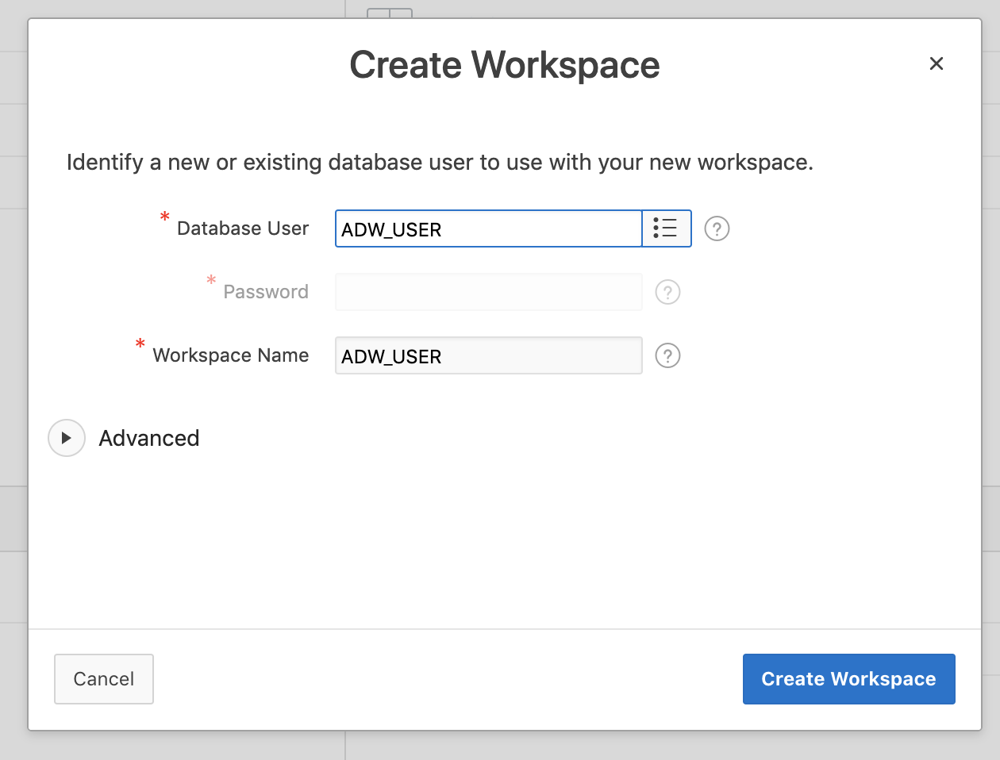

# Setup database

(1) Create ADW and open WebSQL.

(2) Create schema ADW_USER in database
```sql
create user ADW_USER identified by "<password>";
grant dwrole to ADW_USER;
```
(2) Run [create_table.sql](https://github.com/alpsteam/wuzzler-game-server/blob/master/sql/create_table.sql) to create `vector`and `event` table.
  
(3) Open APEX console and login as `INTERNAL`, `ADMIN`, `<password>`.

(4) Create new workspace with database user `ADW_USER` and workspace name `ADW_USER`. Logout and sign in again into the new workspace.



(5) Go to `SQL Workshop`, `Restful Services` and import [ORDS_REST_ACW_acw_vector.sql](https://github.com/alpsteam/wuzzler-game-server/blob/master/sql/ORDS_REST_ACW_acw_vector.sql).
